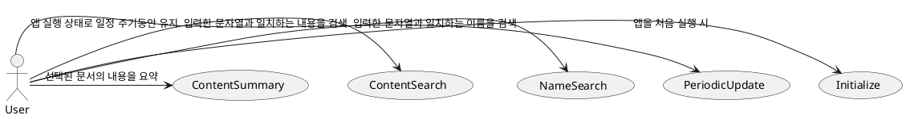

# File Explorer Usecase

```plantuml
@startuml
actor User
usecase Initialize
usecase PeriodicUpdate
usecase NameSearch
usecase ContentSearch
usecase ContentSummary

User -> Initialize : 앱을 처음 실행 시
User -> PeriodicUpdate : 앱 실행 상태로 일정 주기동안 유지
User -> NameSearch : 입력한 문자열과 일치하는 이름을 검색
User -> ContentSearch : 입력한 문자열과 일치하는 내용을 검색
User -> ContentSummary : 선택된 문서의 내용을 요약
@enduml
```
