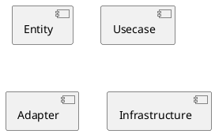

# Architecture

## Clean architecture

File Explorer는 클린 아키텍처에서 말하는 4개의 레이어 계층을 갖는다.

각각의 레이어는 다음과 같다.

- Entity : 여러 애플리케이션의 핵심적인 기능인 사업 규칙(business rule)을 포함
- Usecase : 시스템이 어떻게 자동화 될 것인지 정의하고 애플리케이션의 행위를 결정
- Adapter : 도메인과 인프라 사이의 번역기
- Insfrastructure : 모든 입출력을 포함
