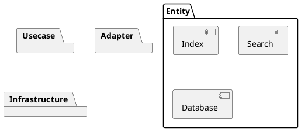

# Architecture

## Clean architecture

File Explorer는 클린 아키텍처에서 말하는 4개의 레이어 계층을 갖는다.

각각의 레이어는 다음과 같다.

- Entity : 여러 애플리케이션의 핵심적인 기능인 사업 규칙(business rule)을 포함
- Usecase : 시스템이 어떻게 자동화 될 것인지 정의하고 애플리케이션의 행위를 결정
- Adapter : 도메인과 인프라 사이의 번역기
- Insfrastructure : 모든 입출력을 포함

## Entity

`Entity`에는 File Explorer에서 핵심적으로 필요로하는 기능들을 포함하고 있다.

`Index`는 로컬 파일 및 폴더의 이름을 기반으로 `Trie`를 구성하여 검색에 용이하도록 정렬

`Search`
