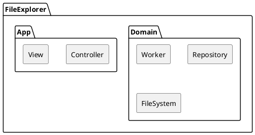

# File Explorer Requirements

## Functional Requirements

- `Initialize`: FileExplorer를 실행 시 로컬 저장소에 포함된 모든 파일과 폴더의 정보를 기록하여 데이터베이스에 저장
- `PeriodicUpdate`: 설정된 주기에 따라 로컬 저장소에 포함된 모든 파일과 폴더의 정보를 기록하여 데이터베이스에 저장
- `NameSearch`: `이름 검색`에 문자열을 입력하면 일치하는 문자열을 포함한 이름을 갖는 모든 파일과 폴더 리스트를 출력
- `ContentSearch`: `내용 검색`에 문자열을 입력하면 일치하는 문자열을 포함한 내용을 갖는 모든 파일 리스트를 출력
- `ContentSummary`: `내용 요약`을 요청하면 특정 문서의 내용을 요약하여 출력

`

